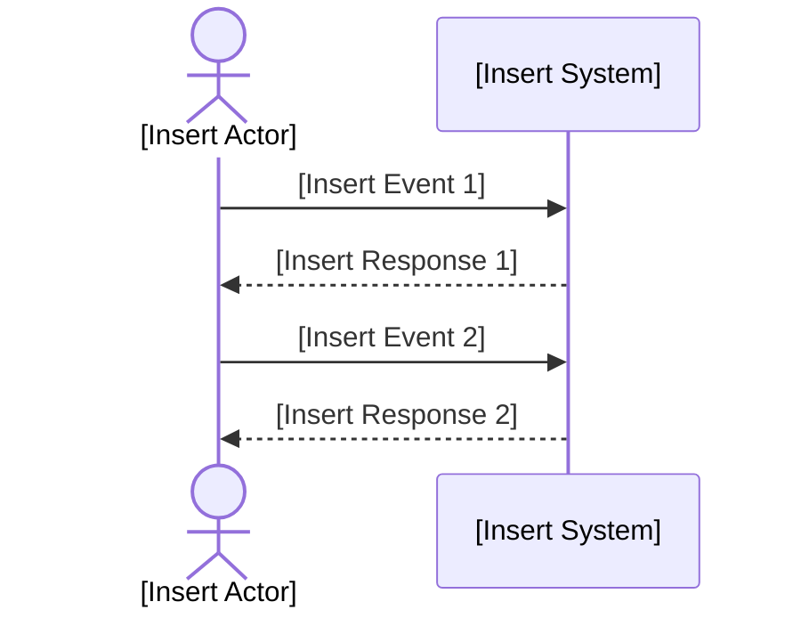

# System Sequence Diagram (SSD) Instructions
This instruction file provides a template and quality criteria for documenting System Sequence Diagrams (SSD) in markdown format.
Use this as a starting point for any project requiring an SSD. Replace all placeholders in the diagram with project-specific content.

## General Instructions
- Use this template for all SSD documentation in markdown format.
- Replace all bracketed placeholders in the diagram with project-specific information.
- Store SSD files in the centralized repository.
- Review and approve SSDs with relevant stakeholders before acceptance.

## Best Practices
- Clearly define all actors, system boundaries, events, and responses.
- Use clear, concise, and system-oriented language.
- Document all assumptions and dependencies.
- Ensure visuals and layout are consistent and easy to understand.

## Code Standards
- Each SSD must have a unique version identifier and a documented change log.
- Use the provided Mermaid sequence diagram layout for consistency.

### File Naming
- Name files in lowercase, using digits for version,
  - following the file name pattern: `uc-xxx.ssd.xxxx.md` (e.g., `uc-xxx.ssd.0001.md`).
    - add use case identifier as prefix for filename.
    - save files in a subfolder named after the use case (e.g., `docs/use-cases/uc-xxx/uc-xxx.ssd.0001.md`).
- Increment version numbers for significant changes.
- Include the todays date and author in the version log.
- we only keep the latest version in the main branch; delete older versions or archive them in a designated folder `archive`.

## Common Patterns
### Good Example
```markdown
## Metadata
| Key               | Value                             |
|-------------------|-----------------------------------|
| Id                | [Use case identifier].SSD         |
| crossReference    | [Use case identifier] [Use case identifier].DM |

## Version Log
| Version | Date       | Description              | Author     |
|---------|------------|--------------------------|------------|
| 0001    | [insert todays date] | Initial                  | project owner |

## System Sequence Diagram
<!-- System Sequence Diagram Template: Replace all [Insert ...] placeholders with project-specific content. -->
```



## Validation
- Review SSDs for completeness, clarity, and correct use of the template.
- Verify that all placeholders are replaced with project-specific content.

## Maintenance
- Update the version and change log for major changes.
- Regularly review SSDs for accuracy and relevance.

## Language
- Professional
- English
- If product owner domain language is different, use that language for the diagram content while maintaining English for metadata and versioning. And save the file with a language code suffix (e.g., `uc-xxx.ssd.0001.da.md` for Danish). So now we have two files: `uc-xxx.ssd.0001.md` (English) and `uc-xxx.ssd.0001.da.md` (Danish).
